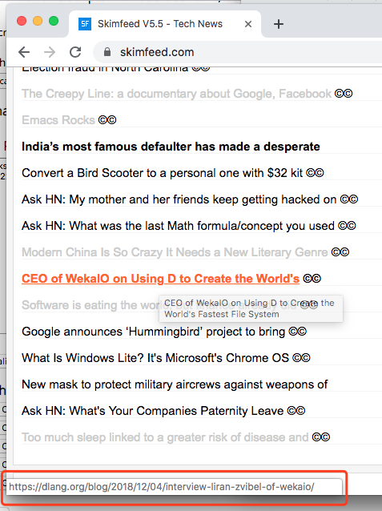

# Prevent Skimfeed Redirect

Userscript to remove Skimfeed.com redirect links. 

## Example

The link [https://skimfeed.com/r.php?q=12&l=7322622&u=https%3A%2F%2Fwww.cnn.com%2F2018%2F12%2F04%2Fhealth](https://skimfeed.com/r.php?q=12&l=7322622&u=https%3A%2F%2Fwww.cnn.com%2F2018%2F12%2F04%2Fhealth) will be changed to [https://ww.cnn.com/2018/12/04/health](https://ww.cnn.com/2018/12/04/health)

## Installation

1. Install [Tampermonkey](https://tampermonkey.net/) (or other userscript extension) for your browser
2. [Install this script from Greasy Fork](https://greasyfork.org/en/scripts/375211-prevent-skimfeed-redirect)
